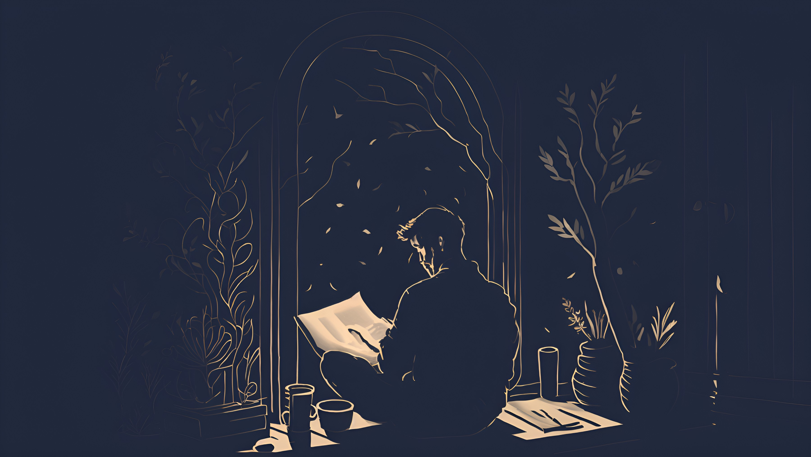
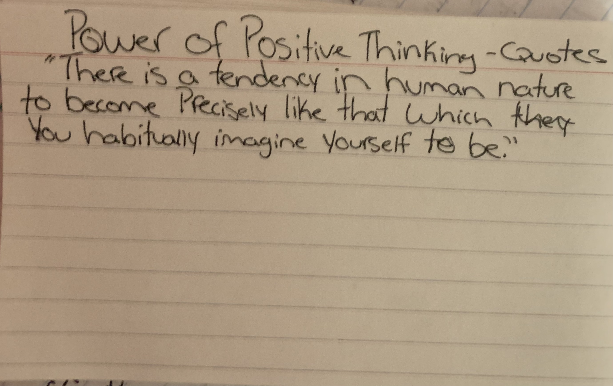
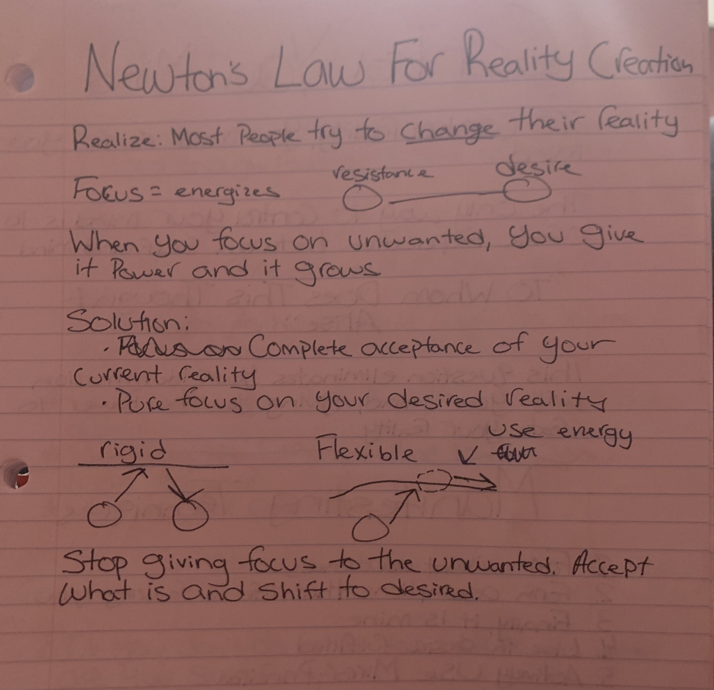
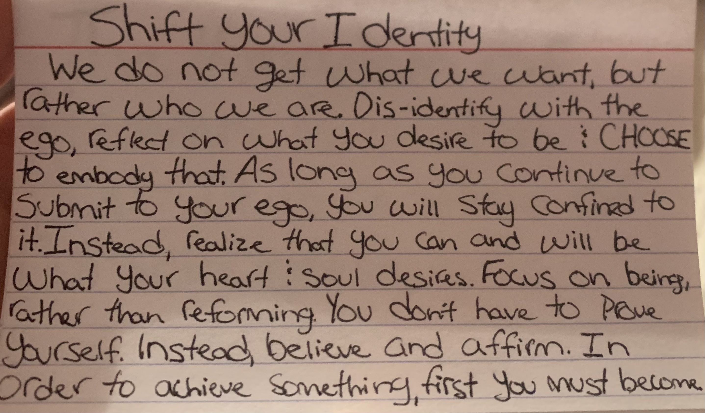
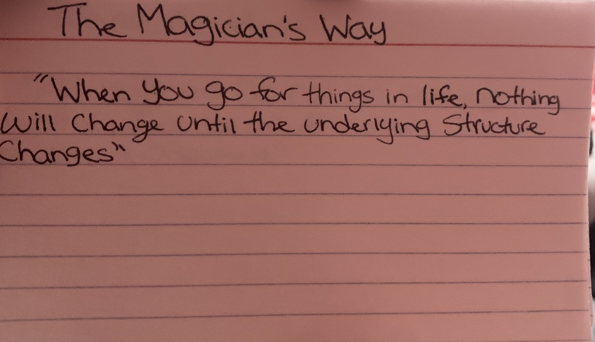
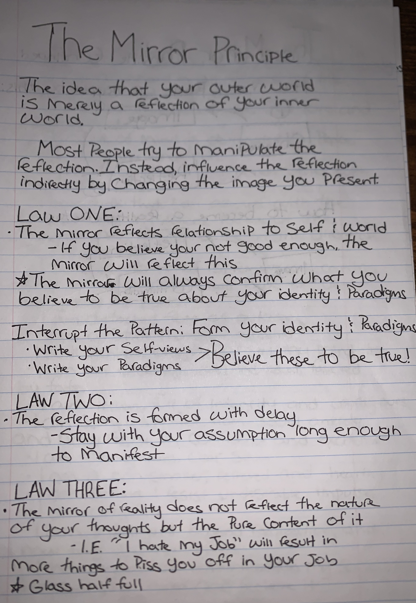
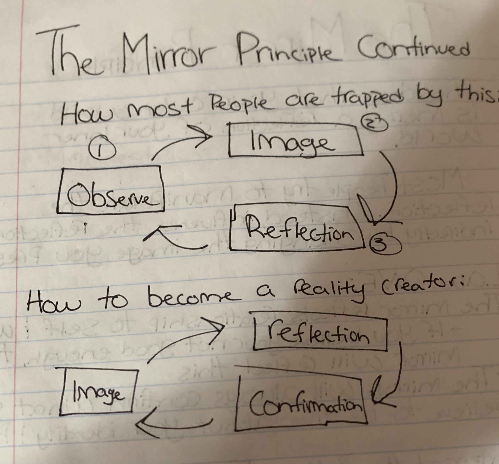
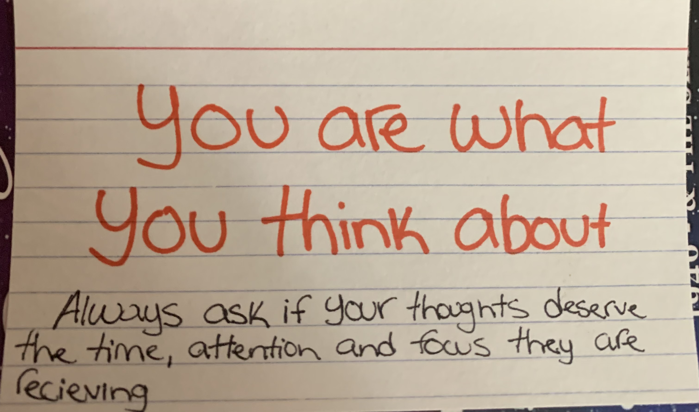

# Blueprints For A Better Future

---

A collection of notes, thoughts, ideas, wisdom and schematics to create a better future for yourself.

---

## Building A Solid Foundation

---

### In Life

- **Always Be Kind**.
- **Don't Judge** **People**. **Period**.
- **Listen** With The Intent To **Understand** Not Just To **Respond**.
- **Give** **More** Than You **Take**.
- **Don't Be Afraid** To **Ask For Help**.
- **Think** Before You **Speak**.
- If Something Is **Important** To **You**, Let It Be Known With **Passion**.
- Learn How To **Control Your Emotions Without Becoming Emotionless**.
- Figure Out What You Are **Passionate** About And **Pursue It Endlessly**.
- **Be Forgiving**.
- Learn To **Let Shit Go**.

---

### In Love

- **Communication** Is The Number One Key To A Successful Relationship.
- **Always** Be **Honest**, No Matter What's At Stake.
- **Be Present**, Both **Mentally** And **Physically**.
- **Love** And **Lust** Are Two Completely Different Feelings. **Understand Them Both**.

---

### Questions

- Are you guided by passion or by corruption?
- Are you the person you want to be or did you become who you are because you follow what others wanted for you instead?
- Do you believe in change, or do you live ignorantly based on the false assumptions those before you had?
- These are questions you should stop and ask yourself because the answers to either side of these questions define who you are and who you have been.
- Only after giving some thought to them will you be able to change who you will become.

---

### Stay Who You Are

- Be the best friend you can be to those who care about you.
- Always continue to better yourself.
- Accept who you are and do the best you can, to love and take care of yourself.
- Last but not least. STOP looking for love, love will always find you.

----

## Building a Better Future

---

**Summary:** In order to create a better future, we must focus on sustainable development, technological advancements, social equity, and education. By prioritizing these four key areas, we can foster a world where the environment is preserved, the economy thrives, and all citizens have the opportunity to lead fulfilling lives.

- Sustainable Development: Implementing eco-friendly practices, such as renewable energy, green infrastructure, and sustainable agriculture, will help protect the planet and its resources for future generations. Collaboration between governments, businesses, and individuals is crucial to achieve global sustainability goals.
- Technological Advancements: Encouraging research and development in areas such as artificial intelligence, biotechnology, and renewable energy will drive economic growth and improve living standards. Supporting tech startups and fostering a culture of innovation will help ensure a prosperous future.
- Social Equity: Addressing inequality and fostering inclusivity are essential for a better future. By ensuring equal access to opportunities, resources, and decision-making power, we can create a more just society. This includes promoting diversity and equal representation in all sectors, as well as implementing policies that reduce wealth gaps and provide essential services to all citizens.
- Education: Investing in quality education for all will empower individuals to reach their full potential and contribute to society. This includes providing access to primary, secondary, and higher education, as well as promoting lifelong learning and vocational training. By nurturing critical thinking, creativity, and problem-solving skills, we can cultivate a generation of global citizens ready to tackle the challenges of the future.
- Healthcare: Ensuring access to affordable and quality healthcare for all is vital for a better future. By investing in public health systems, promoting preventative care, and researching new treatments and vaccines, we can create healthier societies and reduce the burden of disease.
- Global Cooperation: Encouraging collaboration and open dialogue between nations will help address pressing global issues like climate change, poverty, and resource scarcity. By working together on international policies and initiatives, we can create a more stable and interconnected world.
- Responsible Governance: Strengthening democratic institutions and promoting transparency, accountability, and the rule of law will foster trust between citizens and their governments. By actively engaging citizens in the decision-making process and prioritizing the public interest, governments can ensure that policies are responsive to the needs of the population.
- Economic Resilience: Building a robust and diversified economy that can withstand global shocks is essential for long-term prosperity. By promoting entrepreneurship, supporting small and medium-sized businesses, and investing in infrastructure and research, we can create a more resilient economic landscape.
- Climate Action: Mitigating the effects of climate change and preparing for its impacts is critical for the well-being of both current and future generations. By adopting ambitious climate goals, investing in climate-resilient infrastructure, and transitioning to low-carbon economies, we can minimize the harmful consequences of a changing climate.
- Community Engagement: Empowering communities to actively participate in the decision-making process and contribute to local initiatives will create a sense of shared responsibility and ownership. By nurturing grassroots movements and supporting community-driven projects, we can foster a more inclusive and participatory society.

By focusing on these ten key areas, we can create a comprehensive blueprint for building a better future that is sustainable, equitable, and prosperous for all. Collaboration and collective action are essential to achieving these ambitious goals and ensuring that the world we leave behind is one that future generations can be proud of.

---

## Blueprints for Utopia

---

**Here are the key components:**

- Foundation: Education - Lay a strong foundation by ensuring equal access to quality education for everyone, fostering critical thinking, creativity, and adaptability.
- Pillars: Equality and Social Justice - Erect the pillars of equality and social justice, promoting equal opportunities, dismantling systemic barriers, and advocating for the rights and dignity of all people.
- Walls: Economic Stability - Construct walls of economic stability by cultivating a healthy, diverse, and robust economy that benefits everyone, encourages innovation, and supports sustainable growth.
- Windows: Transparency and Accountability - Install windows of transparency and accountability in governance and institutions, fostering trust and promoting open dialogue.
- Roof: Environmental Stewardship - Shelter the utopia with a roof of environmental stewardship, embracing green technologies, promoting conservation, and combating climate change.
- Doors: Global Collaboration - Open doors to global collaboration, nurturing international partnerships, and working together to tackle shared challenges.
- Garden: Cultural Diversity - Cultivate a garden of cultural diversity, celebrating and learning from the rich tapestry of human experiences, fostering empathy, and promoting unity in diversity.
- Solar Panels: Technological Innovation - Harness the power of technological innovation, investing in research and development to advance healthcare, communication, and sustainability.
- Plumbing: Mental Health and Well-being - Ensure the smooth flow of mental health and well-being by destigmatizing mental health issues, increasing access to mental health care, and promoting a culture of compassion and self-care.
- Security System: Peace and Conflict Resolution - Secure the utopia with a system of peace and conflict resolution, promoting diplomacy, addressing the root causes of conflicts, and championing human rights.

With these metaphorical blueprints, we can work together to build a better future for all.

---

## Daily Wisdom With Everett Smith

---

### An ALTER EGO Could Change Your Life

[An ALTER EGO Could Change Your Life](https://www.youtube.com/watch?v=nHtLk-M6hsE)

---

### Power of Positive Thinking

---

#### Power of Positive Thinking - Quotes

**"There Is A Tendency In Human Nature To Become Precisely Like That Which You Habitually Imagine Yourself To Be"**

#### You Are What You Think About

**"Always Ask If Your Thoughts Deserve The Time, Attention, And Focus They Are  
Receiving.''**

---

##### Notes

	I find the best way too remove problems that seem to overbear you, is to love them. Every single one, and to visualize this problem, and to think of how these issues you deal with have the potential to better your life, in any way, shape, or form. No matter how stressful, how tedious, or painful these problems are, once you remove the negative feelings attached to them, they become opportunities rather than problems.

---

### Newtons Law For Reality Creation

---

**Realize**:

- Most People Try To Change Their Reality
- Focus = Energies

	Resistance <----> Desire

- When You Focus On Unwanted, You Give It Power And It Grows

**Solution**:

- Complete Acceptance of Your Current Reality
- Pure Focus on Your Desired Reality

**Stop Giving Focus To The Unwanted. Accept What Is And Shift To Desired.**

---

#### Notes

	The key to growth is understanding that without changing the underlying structure, (yourself) nothing will change. It will be a long and usually fruitless battle with yourself to change your habits, actions and patterns when you identify with them. Instead, start and end your day identifying who you wish to be, how you wish to think, how you wish to feel, and what not. Next, stop giving power to what bothers you. Your power = your awareness. The more you react and focus your awareness on the negative, the more it plays a part in your life. If you can be indifferent, or better yet love it, it will remove itself from your life. 

---

### Shift Your Identity

---

- We Do Not Get What We Want, But Rather Who We Are.
- Dis-identify With The Ego, Reflect On What You Desire To Be And **CHOOSE** To Embody That.
- As Long As You Continue To Submit To Your Ego, You Will Stay Confined To It. Instead, Realize That You Can And Will Be What Your Heart And Soul Desires.
- Focus On Being, Rather Than Reforming.
- You **Don’t** Have To Prove Yourself. Instead, Believe And Affirm.
- In Order To Achieve Something, First You Must Become.

---

#### Notes

	We are all playing as characters, and we have the choice consciously too choose what that character is. Take some time too think about who you want too be and write it down. Then, embody that person as if you already are that person. How would this version of me think? How would this version of me respond to this situation? Dont focus on reforming because you are creating more problems than needed. Finally, feel it to be true, for feelings are the way you respond to your subconscious, and your subconscious is what makes this a reality.

---

### The Magician's Way

**"When You Go For Things In Life, Nothing Will Change Until The Underrying Structure  
Changes"**

---

### The Mirror Principle

---

- The Idea That Your Outer World Is Merely A Reflection Of Your Inner World.
- Most People Try To Manipulate The Reflection. Instead, Influence The Reflection Indirectly By Changing The Image You Present.

---

#### LAW ONE

- The Mirror Reflects Relationship To Self And World.
	- If You Believe You're Not Good Enough, The Mirror Will Reflect This.
- The Mirror Will Always Confirm What You Believe To Be True About Your Identity And Paradigms.

##### Interrupt The Pattern

**Form Your Identity and Paradigms**

- Write Your Self-Views
- Write Your Paradigms

**Believe These To Be True!**

---

#### LAW TWO

**The Reflection Is Formed With Delay**

- Stay with your assumption long enough to manifest.

---

#### LAW THREE

**The Mirror Of Reality Does Not Reflect The Nature Of Your Thoughts, But The Pure Content Of It.**

- I.E. "'I Hate My Job" Will Result In More Things To Piss You Off In Your Job
- Glass Half Full

---

##### Notes

	This right here is how you apply what I wrote above. Instead of continuing too give in too old beliefs and ideas about life that bring you down, you use this to form your thoughts and beliefs that help you. For example, if you have the firm belief that something always stressed you out, change your thought too, “this is easy and I handle it with zero problems”. You have to feel it to be true however, and the greatest way is to catch yourself in a old belief and thought, step back and change that thought and feeling.

---

### The Power of Your Subconcious

[The Power of Your Subconcious](https://www.youtube.com/watch?v=fk2neb420R0&t=4s&pp=2AEEkAIB)

---

### You Are What You Think About

## Decisions

---

	I really want to write to inspire, I want to be known for something positive, someone who was able to help others who are going through some bad shit. 
	
	For the last few years, I've been consumed with so much negativity and during that time I was unable to see the good things and the effects I had on people around me, most of all my children. 
	
	I wish I had gotten myself out of that situation years ago, but I was so convinced I could change the situation's outcome. 
	
	Towards the end of that relationship I was changing, I was becoming a better man by acknowledging my flaws and my mistakes, but sometimes it's just too late to save something that was always doomed from the start. 
	
	Life can be so hard sometimes, especially when we are the ones who choose to make decisions that can come back and bite us in the ass.

---

## Dreamscapes

---

**Overview:** Dreamscapes is an interactive, immersive experience that combines technology, art, and storytelling to inspire people to envision a better future. By participating in Dreamscapes, individuals can create, explore, and share their own blueprints for a better future, encouraging collaboration and conversation around sustainable, inclusive, and innovative solutions.

**Key Components:**

- Augmented Reality (AR) Blueprint Studio: Participants can design their own blueprints for a better future using an intuitive AR interface. They can select from various sustainable materials, technologies, and design elements, then create and visualize their ideas in real-time. This allows people to build cities, transportation systems, energy sources, and social structures that represent their dreams for a better world.
- Dreamscapes Gallery: Once blueprints are completed, they can be showcased in the Dreamscapes Gallery, where visitors can explore the creations in a virtual environment. Participants can see the potential impact of their ideas, interact with other blueprints, and learn about the principles behind the designs. The gallery serves as a platform for exchanging ideas and fostering conversations about sustainable and inclusive futures.
- Storytelling Workshops: Dreamscapes also offers storytelling workshops, where participants can develop narratives that accompany their blueprints. These stories provide context, inspiration, and a sense of the potential future world their blueprints could create. The workshops help people hone their storytelling skills and emphasize the importance of narrative in shaping our collective future.
- Collaborative Challenges: Periodically, Dreamscapes will host collaborative challenges that bring people together to create solutions for specific global problems. These challenges will involve participants working together to create a cohesive blueprint that addresses a particular issue, fostering collaboration, innovation, and cross-disciplinary thinking.
- Dreamscapes Impact Award: To encourage ongoing engagement and to support participants in bringing their ideas to life, Dreamscapes will offer an annual Impact Award. This award will provide funding and mentorship to help transform the most promising blueprints into real-world projects.

By merging technology, creativity, and collaboration, Dreamscapes offers an exciting and innovative approach to envisioning a better future. With this platform, we can inspire and empower people to dream big, think critically, and work together to create the world we all wish to see.

---

## Dry Erase

---

1.     Just Like This Dry Erase Board, Every New Day Is A Chance To Wipe The Slate Clean. 
2.     You Cant Ever Change What Happend You Can Never Go Back. 

- Living In The Past Kills Every Opportunity To Be Happy In The Present.
- Let Sadness Run Its Course,
	- This Is Your One Time To Grieve & Feel Sorry For Yourself.
	- Do Not Let Sadness Stay, It Must Be Allowed To Visit, But You Must Never Build A House For It.
- This Is A Lesson You Will Only Understand Later In Life.
- This Is Not The End Of Your Story, This Is Just Part of The Unfortunate Events That Will Lead You To Your Success.
- You Are The Underdog.
- You Will Rise Up From This

---

## Emotional Growth Imagery

---

- The Compassion Tree: Depict a thriving tree with leaves representing various acts of kindness and empathy. Each leaf can contain a symbol or text, like "listening," "giving compliments," or "helping others."
- The Empathy Lighthouse: Show a lighthouse shining brightly in the darkness, guiding lost souls back to emotional safety. The rays of light can represent understanding, support, and open communication.
- The Mindful Garden: Portray a beautiful garden with various plants symbolizing mindfulness practices such as meditation, deep breathing, and journaling, which help cultivate self-awareness and emotional intelligence.
- The Bridge of Understanding: Illustrate a bridge connecting two cliffs, representing the gap between individuals' emotions and experiences. Along the bridge, place symbols of empathy, active listening, and validation.
- The Emotional Color Palette: Design a painter's palette filled with vibrant colors, each symbolizing different emotions. The brushes represent tools for understanding and expressing emotions healthily.
- The Kindness Quilt: Depict a cozy quilt made of patches, each displaying a heartwarming act of kindness or encouraging words. The quilt represents the collective warmth and love generated through compassion.
- The Harmony Orchestra: Create an image of an orchestra where each instrument represents a different aspect of emotional intelligence, such as self-awareness, empathy, and social skills. The harmonious music symbolizes personal growth and emotional balance.
- The Empathy Cloud: Illustrate a cloud raining down droplets of empathy, understanding, and love onto people below. The rain nourishes the ground, creating a lush, green landscape that represents a supportive and compassionate community.
- The Emotional Map: Design a treasure map with a path marked by milestones such as self-awareness, empathy, and emotional resilience. The "X" marks the destination of a better, kinder future for oneself and others.
- The Kindness Kaleidoscope: Portray a kaleidoscope filled with colorful patterns formed by various symbols of kindness, compassion, and understanding. The ever-changing patterns represent the endless possibilities for personal growth and emotional development.
- The Empathy Elevator: Illustrate an elevator with buttons labeled with various empathetic actions and emotions such as "patience," "compassion," and "active listening." The elevator represents the journey towards becoming a better person.
- The Growth Staircase: Depict a staircase with each step representing a personal growth milestone, such as "forgiveness," "self-compassion," and "empathy." Climbing the staircase symbolizes the continuous journey towards self-improvement.
- The Emotional Library: Design a library with bookshelves filled with books titled with different emotions, acts of kindness, and personal growth topics. The library represents the wealth of knowledge and understanding available for personal growth.
- The Gratitude Balloon: Illustrate a hot air balloon decorated with expressions of gratitude, carrying people to new heights of happiness and self-awareness. The balloon symbolizes the uplifting power of gratitude and appreciation.
- The Mindful Hourglass: Portray an hourglass filled with symbols of mindfulness practices such as deep breathing, meditation, and body scans. The sand grains represent moments in time, encouraging the importance of being present and aware.
- The Compassionate Mirror: Show a mirror reflecting a person's image along with their kind and empathetic actions, such as helping others, offering support, and being understanding. The mirror represents self-reflection and the power of inner growth.
- The Emotional Weather Vane: Depict a weather vane with symbols of various emotions and empathetic actions, illustrating how our emotional state can change direction. The weather vane represents the importance of adapting to and understanding our emotional landscape.
- The Resilience River: Illustrate a river flowing through various emotional landscapes, such as rocky rapids, calm waters, and waterfalls, symbolizing the ups and downs of life. The river represents the journey towards emotional resilience and personal growth.
- The Kindness Telescope: Portray a telescope that, when looked through, reveals acts of kindness and compassion in the distance. The telescope represents the ability to focus on and appreciate the positive aspects of life and relationships.
- The Emotional Labyrinth: Design a labyrinth containing various symbols of emotions, acts of kindness, and personal growth milestones. The labyrinth represents the complex journey towards emotional self-discovery and the development of a better, more compassionate self.
- The Emotional Symphony: Illustrate a conductor leading an orchestra, with musicians playing instruments that represent various emotions, acts of kindness, and personal growth elements. The harmonious music symbolizes the balance and beauty achieved by embracing our emotional diversity.
- The Empathy Mountain: Depict a mountain range with peaks representing different aspects of empathy, kindness, and understanding. The journey to the summit symbolizes the challenges and rewards of personal and emotional growth.
- The Kindness Campfire: Portray a warm campfire surrounded by people sharing stories of kindness, empathy, and compassion. The campfire represents the bonding and transformative power of these shared experiences.
- The Gratitude Fountain: Illustrate a fountain overflowing with water, with each drop symbolizing a moment of gratitude or an act of kindness. The fountain represents the abundance and rejuvenation that come from embracing gratitude in our lives.
- The Emotional Carousel: Design a carousel with horses and other creatures representing various emotions and acts of kindness. The carousel's movement symbolizes the cyclical nature of our emotional experiences and the importance of embracing each stage.
- The Mindful Maze: Depict a maze filled with symbols of mindfulness practices and emotional growth milestones. The maze represents the challenging but rewarding journey towards self-discovery, personal growth, and emotional balance.
- The Compassionate Constellation: Illustrate a starry sky with constellations formed by stars representing acts of kindness, empathy, and understanding. The constellations symbolize the universal and timeless nature of these qualities in fostering a better future.
- The Resilience Reef: Portray a vibrant coral reef with various sea creatures symbolizing emotional resilience, personal growth, and empathy. The reef represents the interconnectedness and adaptability required to navigate life's emotional challenges.
- The Emotional Chessboard: Design a chessboard with pieces representing different emotions, acts of kindness, and personal growth strategies. The chessboard symbolizes the strategic and thoughtful approach needed to manage our emotional lives effectively.
- The Kindness Time Capsule: Illustrate a time capsule filled with tokens of kindness, empathy, and understanding, representing the lasting impact of these qualities on individuals and society. The time capsule symbolizes the importance of preserving and cultivating these values to build a better future.
- The Empathy Echo: Depict a canyon where sound waves representing empathetic words and actions bounce off the walls, creating echoes. The canyon symbolizes the lasting and far-reaching impact of empathy on individuals and their surroundings.
- The Emotional Garden Path: Portray a winding garden path with various plants and flowers symbolizing different emotions, acts of kindness, and personal growth elements. The path represents the journey towards emotional balance and self-discovery.
- The Kindness Butterfly Effect: Illustrate a butterfly with wings adorned with symbols of kindness and empathy. The butterfly symbolizes the transformative power of small acts of kindness and their potential to create significant positive change.
- The Gratitude Sunrise: Design a sunrise scene with warm, glowing colors representing feelings of gratitude and appreciation. The sunrise symbolizes the renewing and uplifting power of gratitude in our daily lives.
- The Mindful Origami: Depict a series of intricate origami figures representing mindfulness practices, such as meditation, deep breathing, and self-reflection. The origami symbolizes the art and discipline required to cultivate mindfulness and emotional balance.
- The Compassionate Tapestry: Illustrate a tapestry woven with threads representing acts of kindness, empathy, and understanding. The tapestry symbolizes the interconnectedness of these qualities and their role in creating a supportive emotional fabric.
- The Resilience Arch: Portray a stone arch standing firm amidst a turbulent landscape, symbolizing emotional resilience and the ability to withstand life's challenges. The arch represents the strength and stability that come from personal growth and understanding.
- The Emotional Treasure Chest: Design a treasure chest filled with precious gems, each representing a different emotion, act of kindness, or personal growth milestone. The chest symbolizes the invaluable richness of our emotional experiences and the importance of cherishing them.
- The Kindness Lanterns: Illustrate a night sky filled with floating lanterns, each carrying symbols of kindness, empathy, and compassion. The lanterns represent the collective light created by these qualities, illuminating a better future.
- The Empathy Planetarium: Portray a planetarium with projections of celestial bodies and constellations representing various aspects of empathy, kindness, and emotional growth. The planetarium symbolizes the vast and boundless potential for human understanding and connection.
- The Emotional Weathervane: Illustrate a weathervane displaying various emotions and acts of kindness, representing our ever-changing emotional states. The weathervane symbolizes the importance of adapting and responding to our emotional environment.
- The Gratitude Spiral: Depict a spiral pattern with each loop representing moments of gratitude and appreciation. The spiral symbolizes the expanding and deepening impact of gratitude on our emotional well-being and personal growth.
- The Kindness Domino Effect: Design a series of dominoes, each featuring a symbol of kindness, empathy, or understanding. The dominoes represent the chain reaction created by small acts of kindness, leading to a larger impact on the world.
- The Empathy Nebula: Portray a vibrant and colorful nebula with various elements representing empathy, kindness, and emotional growth. The nebula symbolizes the vastness and beauty of our emotional universe, highlighting the importance of cultivating these qualities.
- The Resilience Mountain Range: Illustrate a mountain range with peaks and valleys representing emotional highs and lows. The range symbolizes the resilience and strength required to traverse the emotional landscape of life.
- The Mindful Hourglass Nebula: Depict a celestial hourglass filled with stardust representing moments of mindfulness and self-awareness. The hourglass nebula symbolizes the infinite possibilities for personal growth and emotional development in the vastness of the cosmos.
- The Emotional Seesaw: Design a seesaw with children representing different emotions, acts of kindness, and personal growth elements. The seesaw symbolizes the importance of balance and adaptability in managing our emotional lives.
- The Compassionate Village: Illustrate a peaceful village where each house represents a different aspect of empathy, kindness, or understanding. The village symbolizes the collective power of a supportive community in fostering emotional growth and well-being.
- The Kindness Planet: Portray a planet with continents and oceans shaped like symbols of kindness, empathy, and compassion. The planet symbolizes a world built on the foundations of these essential human qualities.
- The Empathy Constellation Map: Design a map of the night sky with constellations formed by stars representing various aspects of empathy, kindness, and emotional growth. The map symbolizes the interconnectedness and universality of these qualities in guiding our journey towards a better future.
- The Emotional Harmony Wheel: Illustrate a wheel divided into segments, each representing a different emotion, act of kindness, or personal growth element. The wheel symbolizes the importance of balance and harmony in embracing the full spectrum of our emotional experiences.
- The Gratitude Waterfall: Depict a waterfall cascading into a serene pool, with each droplet representing a moment of gratitude or appreciation. The waterfall symbolizes the continuous flow and rejuvenating power of gratitude in our lives.
- The Mindful Footprints: Portray a series of footprints on a beach, each imprinted with symbols of mindfulness practices and emotional growth milestones. The footprints symbolize the personal journey towards self-awareness and emotional balance.
- The Compassionate Oasis: Design an oasis in a desert landscape, with elements representing acts of kindness, empathy, and understanding. The oasis symbolizes the nourishing and restorative power of compassion in a challenging emotional environment.
- The Kindness Compass: Illustrate a compass with cardinal directions labeled with different aspects of kindness, empathy, and emotional growth. The compass symbolizes the guidance these qualities provide in navigating our emotional journeys.
- The Resilience Phoenix: Depict a phoenix rising from the ashes, symbolizing emotional resilience and the ability to overcome life's challenges. The phoenix represents the transformative power of personal growth and understanding.
- The Empathy Relay: Portray a relay race with runners passing a baton decorated with symbols of empathy, kindness, and compassion. The relay symbolizes the importance of teamwork and cooperation in fostering emotional growth and support.
- The Emotional Recipe Book: Design a recipe book containing various "recipes" for emotional well-being, with ingredients representing different emotions, acts of kindness, and personal growth strategies. The book symbolizes the art and science of nurturing our emotional lives.
- The Kindness Catcher: Illustrate a dream catcher adorned with symbols of kindness, empathy, and understanding. The kindness catcher symbolizes the power of these qualities to protect and uplift our emotional well-being.
- The Empathy Network: Depict a network of interconnected nodes representing individuals, with links symbolizing acts of empathy, kindness, and understanding. The network symbolizes the importance of connection and support in building a better future for ourselves and others.
- The Emotional Alchemist: Portray an alchemist mixing various emotions and acts of kindness in a laboratory, creating a potion for personal growth and emotional balance. The alchemist symbolizes the transformative power of understanding and embracing our emotional experiences.
- The Gratitude Tree: Illustrate a tree with leaves representing moments of gratitude and appreciation. The tree symbolizes the growth, strength, and nourishment that come from cultivating gratitude in our lives.
- The Mindful Bridge: Depict a bridge connecting two shores, with each plank representing a mindfulness practice or personal growth milestone. The bridge symbolizes the journey towards emotional balance and self-awareness.
- The Compassionate Quilt: Design a quilt with patches representing acts of kindness, empathy, and understanding. The quilt symbolizes the warmth and comfort that come from embracing these qualities and supporting one another.
- The Kindness Lighthouse: Portray a lighthouse shining its beam on symbols of kindness, empathy, and compassion in the distance. The lighthouse symbolizes the guiding light that these qualities provide in navigating our emotional journeys.
- The Resilience Anchor: Illustrate an anchor with symbols of emotional resilience, personal growth, and understanding engraved on it. The anchor represents the stability and strength that come from cultivating emotional resilience in our lives.
- The Empathy Orchestra: Depict an orchestra with musicians playing instruments that represent various aspects of empathy, kindness, and emotional growth. The harmonious music symbolizes the balance and beauty achieved by embracing our emotional diversity.
- The Emotional Kaleidoscope: Design a kaleidoscope with various patterns and colors representing different emotions, acts of kindness, and personal growth elements. The kaleidoscope symbolizes the ever-changing and intricate beauty of our emotional experiences.
- The Kindness Bonsai: Illustrate a bonsai tree with branches and leaves symbolizing various aspects of kindness, empathy, and compassion. The bonsai represents the patience, care, and attention required to cultivate these qualities in our lives.
- The Empathy Archipelago: Portray a series of islands, each representing a different aspect of empathy, kindness, or understanding. The archipelago symbolizes the interconnectedness of these qualities and their role in creating a supportive emotional landscape.
- The Emotional Telescope: Illustrate a telescope pointed towards the sky, revealing celestial bodies that represent various emotions, acts of kindness, and personal growth elements. The telescope symbolizes the exploration and discovery of our emotional universe.
- The Gratitude Balloons: Depict a bundle of balloons, each carrying symbols of gratitude and appreciation. The balloons represent the uplifting and liberating power of gratitude in our lives.
- The Mindful Labyrinth: Portray a labyrinth with various symbols of mindfulness practices and emotional growth milestones along its paths. The labyrinth symbolizes the challenging but rewarding journey towards self-discovery, personal growth, and emotional balance.
- The Compassionate Mosaic: Design a mosaic with tiles representing acts of kindness, empathy, and understanding. The mosaic symbolizes the beauty and harmony created by the collective effort of individuals embracing these qualities.
- The Kindness Fountain Pen: Illustrate a fountain pen with ink flowing in the form of symbols of kindness, empathy, and compassion. The pen represents the power of our words and actions in creating a better future.
- The Resilience Shield: Depict a shield adorned with symbols of emotional resilience, personal growth, and understanding. The shield symbolizes the protection and strength that come from cultivating resilience in our lives.
- The Empathy Wave: Portray a wave in the ocean, with various elements representing empathy, kindness, and emotional growth. The wave symbolizes the ebb and flow of our emotional experiences and the importance of embracing them all.
- The Emotional Sundial: Design a sundial with shadows cast by various emotions, acts of kindness, and personal growth elements. The sundial represents the passage of time and the importance of recognizing and embracing our emotional experiences.
- The Kindness Map: Illustrate a map with roads and landmarks representing different aspects of kindness, empathy, and compassion. The map symbolizes the journey towards a better future, guided by these essential human qualities.
- The Empathy Space Station: Depict a space station orbiting Earth, with astronauts from different countries working together and representing various aspects of empathy, kindness, and understanding. The space station symbolizes the importance of global cooperation and shared values in building a better future.
- The Emotional Scales: Illustrate a set of scales balancing various emotions, acts of kindness, and personal growth elements. The scales symbolize the importance of emotional equilibrium and the delicate balance required for personal well-being.
- The Gratitude Mirror: Depict a mirror reflecting images of gratitude and appreciation for the person looking into it. The mirror symbolizes the transformative power of self-reflection and recognizing the value of gratitude in our lives.
- The Mindful Zen Garden: Portray a tranquil Zen garden with elements representing mindfulness practices and emotional growth milestones. The garden symbolizes the serenity and balance achieved through cultivating mindfulness and emotional awareness.
- The Compassionate Clouds: Design a sky filled with clouds shaped like symbols of kindness, empathy, and understanding. The clouds represent the ever-changing nature of our emotional landscape and the importance of embracing these qualities to create a nurturing emotional climate.
- The Kindness Time Machine: Illustrate a time machine that transports people to moments of kindness, empathy, and compassion in history. The time machine symbolizes the timeless and universal nature of these qualities and their role in shaping a better future.
- The Resilience Iceberg: Depict an iceberg with visible symbols of emotional resilience, personal growth, and understanding above the water and additional elements hidden beneath the surface. The iceberg represents the depth and hidden strength of our emotional resilience.
- The Empathy Vortex: Portray a swirling vortex filled with various elements representing empathy, kindness, and emotional growth. The vortex symbolizes the powerful and transformative nature of these qualities when embraced and nurtured.
- The Emotional Rainbow: Design a rainbow with colors representing different emotions, acts of kindness, and personal growth elements. The rainbow symbolizes the beauty and harmony that result from embracing the full spectrum of our emotional experiences.
- The Kindness Bookshelf: Illustrate a bookshelf filled with books, each telling a story of kindness, empathy, or compassion. The bookshelf represents the wealth of knowledge and wisdom that can be gained from learning about and practicing these qualities.
- The Empathy Crystal: Depict a crystal with facets reflecting various aspects of empathy, kindness, and understanding. The crystal symbolizes the multifaceted nature of these qualities and their potential to refract light, creating a brighter future.
- The Emotional Symphony: Portray a conductor leading an orchestra playing a symphony that represents various emotions, acts of kindness, and personal growth elements. The symphony symbolizes the harmony and beauty achieved through embracing and expressing our emotional diversity.
- The Gratitude Garden: Illustrate a lush garden filled with plants and flowers, each representing moments of gratitude and appreciation. The garden symbolizes the growth and nourishment that come from cultivating gratitude in our lives.
- The Mindful Mobile: Design a hanging mobile with elements representing mindfulness practices and emotional growth milestones. The mobile symbolizes the delicate balance and movement achieved through cultivating mindfulness and emotional awareness.
- The Compassionate Campfire: Depict a group of people sitting around a campfire, sharing stories of kindness, empathy, and understanding. The campfire represents the warmth, connection, and support that come from embracing these qualities in our relationships.
- The Kindness Constellation: Portray a night sky filled with stars forming a constellation that represents kindness, empathy, and compassion. The constellation symbolizes the guiding light that these qualities provide in our journey towards a better future.
- The Resilience Treehouse: Illustrate a treehouse built on the branches of a tree that represents emotional resilience, personal growth, and understanding. The treehouse symbolizes the safe haven and stability that come from cultivating resilience in our lives.
- The Empathy Aquarium: Design an aquarium filled with various marine creatures that represent different aspects of empathy, kindness, and emotional growth. The aquarium symbolizes the diverse and interconnected ecosystem of these qualities and their role in creating a nurturing emotional environment.
- The Emotional Jigsaw Puzzle: Depict a jigsaw puzzle with pieces representing different emotions, acts of kindness, and personal growth elements. The puzzle symbolizes the challenge and satisfaction of fitting together the pieces of our emotional lives to create a complete picture.
- The Kindness Ladder: Illustrate a ladder with steps adorned with symbols of kindness, empathy, and compassion. The ladder represents the personal growth and elevation achieved by embracing and practicing these qualities in our lives.
- The Empathy Planetarium Show: Portray a planetarium show with projections of celestial bodies and constellations that represent various aspects of empathy, kindness, and emotional growth. The show symbolizes the exploration and discovery of the vast and boundless potential for human understanding and connection.

## Endings

---

	Endings are hard, life-changing, and sometimes life-ending.  
	I think it's safe to say I'll never be the same person I was before 2017.  
	
	Dreams were shattered, love was broken, and hope was lost. That fear of monsters being real as a child came to life, except that those monsters never came from under the bed or out of the closet, they disguised themselves in human form.  
	
	They became the reason I never slept, they got in my head and made me question my self-worth. They made me believe I would never be anything and I'd never be happy again. They made me question my own life every day until I started becoming one of them myself.  
	
	My whole life I lived by a set of standards and morals so that I would never cross over to the dark side. I had boundaries and lines that I would never cross to keep me safe from being the next Anakin Skywalker and now I understand exactly why he became Darth Vader because when people you love, fuck you up and show you a side of themselves and life that you never thought was real, it creates a catastrophic chain of events inside your belief system and in the foundation you've built your life upon.  
	
	Love turned into pain, the pain turned into hate and hate turned into feeling nothing.  
	What I've learned, is that Hate is not the greatest negative emotion, feeling nothing is. If you hate something it's for a reason, a purpose, but to feel nothing and do things that hurt people for no reason, for no purpose, you can really fuck the world up, and far too many of us feel nothing anymore.  
	
	For a long time, I balanced myself on all the lines that I swore I would never cross, and then one by one I didn't care anymore, and after every line I crossed, that structure and foundation of who I once was started caving in.  
	
	Wall after wall, floor after floor, until it buried me underneath it and it wasn't until the basement collapsed that I realized there is no rock bottom, there's no bottom at all to the holes we dig for ourselves, it's never-ending and you can just keep going until the consequences of your actions and choices catch up to you and either kill you or mentally impair you.

---

## Future Blueprint Ideas

---

- Green Urban Landscapes: Create images of futuristic cities with vertical gardens, green roofs, and tree-lined streets, showcasing sustainable urban planning and eco-friendly architecture.
- Clean Energy Infrastructure: Depict various forms of clean energy like solar farms, wind turbines, and tidal power plants, symbolizing the transition to renewable energy sources.
- Waste Reduction Solutions: Illustrate innovative waste management systems, such as zero-waste communities, recycling robots, and biodegradable packaging, highlighting a future with minimal waste.
- Advanced Transportation: Showcase futuristic transportation methods like hyperloop systems, electric vehicles, and autonomous flying cars, emphasizing a future with reduced emissions and efficient travel.
- Inclusive Spaces: Design images of accessible, diverse public spaces that promote social cohesion and inclusivity, featuring universal design principles and vibrant community gardens.
- Edible Insect Farms: Present images of sustainable food sources like vertical insect farms, showcasing alternative protein sources that have lower environmental impacts compared to traditional livestock farming.
- Ocean Cleanup Initiatives: Depict large-scale ocean cleanup technologies, such as floating barriers and autonomous waste-collecting drones, to represent a future with cleaner oceans and thriving marine ecosystems.
- Advanced Education Systems: Illustrate futuristic educational environments that harness technology for personalized learning, including virtual reality classrooms and AI-assisted teaching.
- Global Water Management: Create images of innovative water management systems like atmospheric water generators, desalination plants, and efficient irrigation methods, highlighting the importance of water conservation in the future.
- Space Exploration and Colonization: Depict human settlements on other planets, space stations, and asteroid mining operations, showcasing the potential for humanity to explore and inhabit new frontiers for a better future.

## Future Metaphors Unveiled

---

- Blueprints to a better future are like seeds of hope, sprouting and growing into flourishing gardens of change.
- Blueprints to a better future are the compass of progress, guiding us on a journey towards an enlightened destination.
- Like the conductor's baton orchestrating a symphony of innovation, blueprints to a better future harmonize our collective efforts towards a brighter tomorrow.
- Blueprints to a better future are like a patchwork quilt, stitching together the diverse fabric of society into a warm embrace of unity.
- Blueprints to a better future are like the North Star, a beacon of light illuminating the path to a more inclusive and sustainable world.
- Like the intricate gears of a masterfully crafted clock, blueprints to a better future mesh together the interdependent cogs of society to keep the hands of progress moving forward.
- Blueprints to a better future are the master chef's recipe, blending the finest ingredients of human ingenuity and compassion to create a gourmet meal of global well-being.
- Like the architect's vision shaping a city skyline, blueprints to a better future sculpt the contours of our collective dreams into a landscape of boundless possibility.
- Blueprints to a better future are the loom on which we weave the tapestry of humanity's legacy, crafting a vibrant and enduring pattern of prosperity.
- Like a lighthouse guiding ships through stormy seas, blueprints to a better future are the steadfast beacons that steer our society towards the shores of a more promising tomorrow.

---

## Glad To Exist

---

**2021-08-24 7:37 AM**

>Happy to be here, thankful that others continued to see the things within me that I could not see in myself. Humbled that I got another chance to rewrite my story so it can be told in a more positive way someday. That's what's important, that's what matters, I didn't let my pain and struggles define me, I let them teach me that there's always a better way and that every mountain can be climbed if you just keep going.

---

## Grow Through Your Changes

---

**2014-04-11-081200**

> If you must change, change for the better. Don't change into someone you will grow to hate just to accommodate the person who claims to care about you. Some peoples genetics were infused with too much negativity. You could paint a canvas of all the great things they have in life and surround them with it and the only thing they will notice is how crooked the easel is or that the paint dripped onto the carpet.

---

## Happiness In DNA

---

	Happiness is much like DNA, it's different for everyone. What makes you happy may not be the same guidelines that make others happy. To me, happiness is something that should not be felt 100% of the time, if you are never sad or angry then how do you know you are happy? 
	
	Happiness should be a reminder of all the things you love and that make you smile but not something that should stick around long enough that you forget to appreciate its value. Instead, you can choose to always be grateful. If you believe that money or medicine or a new relationship will make you find happiness, then you will always be looking for more money, more doctors, or more people. 
	
	We are all capable of being happy, the key is to define it yourself and to be grateful for the things you have even after all of your misfortunes. That's a start anyways

---

## Happy

---

>Happiness is not a place somewhere that you have to climb mountains and obstacles to get to, nor is it something that 99 you can only get from other people or the people you love. It's a decision you make every day. You have to understand that your unhappiness comes from continuing to make the decision to keep doing things that aren't good for your soul. Nobody is responsible for your own happiness but you, do what's good for you at all costs. Life is short and death is an open door waiting for you to walk through at any given moment.

---

## Light Absorption

---

>There was a period of time, somewhere between early 2017 to early 2020 where shit got really dark. I didn't things would ever get better, Most days I didn't want to get out and I really wished I would fade out of existence. It was just after my son's 15th Birthday last year when I told myself and my mom that I'm going to get a job and out of my room and I'm going to make my life better. What I can say now is, somewhere in that darkness I found a light and that light grows brighter every day.

---

## More Questions

---

>What is love without hate?  

>Joy without pain?  

>What is light without darkness?

---

## No Grey Area

---

**2015-04-23-111200**

- Are you guided by passion or by corruption? Are you the person you want to be or did you become who you are because you follow what others wanted for you instead?  
- Do you believe in change, or do you live ignorantly based off of the false assumptions those before you had?  
- These are questions you should stop and ask yourself because the answers to either side of these questions define who you are and who you have been.  
- Only after giving some thought to them will you be able to change who you will become.

---

## Passenger

---

**2020-10-31-042139**

>One thing I've come to realize the most is that our inner demons aren't there to hurt us, they're there to hurt all the people that love us, they take them out one by one until it's just you and them and then they become you. I see it all around me, even in myself. So much darkness, so much anger, so much misunderstanding and all that does is bring those demons to life. They are awakened from hibernation by their surroundings, by the trauma, the environment, anxiety, bad relationships, and anything that is negative. You don't have to come from a broken home, you don't have to be abused as a child, and they don't just come out because of your childhood, I think that a lot of them probably stem from your childhood but they thrive more in your adulthood because you no longer have that innocence you had as a child to protect you. We are all born with the sense of wrong and right and the ability to be good or bad. It all comes down to a choice, a line drawn between the light and the darkness and once you cross that line you better distance yourself from everyone who cares about you because you've just become a ticking time bomb to all of them, but of course, it's too late for that cause that good part of you is now permanently in the passenger seat while your demons come to life.  

---

## Punches

---

>Just a reminder that life isn't about what's happened to you, it's about how you pick yourself up and keep going. We are NOT defined by our past, our struggles, or trauma. We are defined by what we choose to do with those things today and in the future. There's always a choice in everything we do and the sooner you accept the responsibility for those choices, the sooner you can grow and move forward

---

## The Bright Sides

---

>Do all things with love and passion, keep moving forward through the pain, through the rain, through every mountain in your way. Those are the things I'm reminded of every time I think about my father. It's what keeps me motivated and what keeps me in check when I'm not living the way he had shown. me. It's never too late to change, it's never too late to outgrow the people who don't bring the same positive energy in your life as you do and that includes family. Your might be connected by blood but there are people out there who are bonded to you by real love, people who will go to war and fight your demons with you. Instead of using them to hurt you. People who won't abandon you when you feel like giving up. People who still continue to show up even when it's inconvenient. People who don't want anything from you but your company.

---

## The Truth Is

---

- You never really heal from certain traumas.
	- They become a part of you forever.
- The only hope is that you don't become the people that hurt you.
	- It's not fair that they did what they did to you, but it's more unfair that you cause someone else the same trauma just because it was done to you.
- Know the difference.
	- Break the cycle or the cycle keeps repeating.
		- Year after year,
			- Generation to generation.

---

## What Is Love

---

>What is love? To me, love isn't just waking up next to you and smiling at your beautiful face first thing in the morning. Love is looking up to see somebody who cares about you with everything they have even when you're mess and hard to be around isn't just about happiness it's about commitment, it's about sacrifice, it's pain, frustration, irritability, love is about doing whatever it takes to put a smile on your lover space when they can't seem to smile at all. Love is more than just a four letter word, it's more that just something you say to somebody you care about it's that feeling you get deep down in your soul when you would give up everything even your own soul save the person you care about. It's about fighting for what you want the most, it's about being patient and setting your own pride aside even when you believe you're right in certain situations. Love is what makes us all better, it's the wind in our sails, the will to keep going on days when you feel like giving up the most. Love is staying up all through the night being disappointed in yourself for the way you reacted during conversation. Love is Beautiful.Love Is You it's something you feel deep down in your soul when you're lost inside your mind and you feel trapped and empty

---

## Write to Inspire

---

**2017-06-18**

	I really want to write to inspire, I want to be known for something positive, someone who was able to help others who are going through some badshit.
	
	For the last few years, I've been consumed with so much negativity and during that time I was unable to see not only the good things but the effects I had on people around me, most of all my children.  
	
	I wish I had gotten myself out of that situation years ago, but I was so convinced I could change the situation outcome.  
	
	Towards the end of that relationship I was changing, I was becoming a better man by acknowledging my flaws and my mistakes, but sometimes it's just too late to save something that was always doomed from the start.  
	
	Life can be so hard sometimes, especially when we are the ones who choose to make decisions that can come back and bite us in the ass.

---
